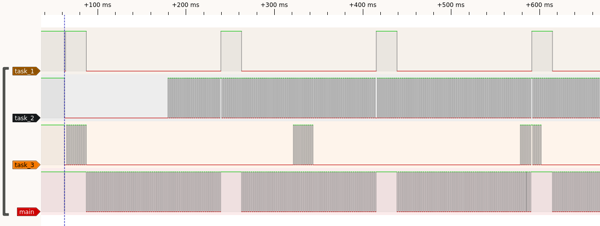
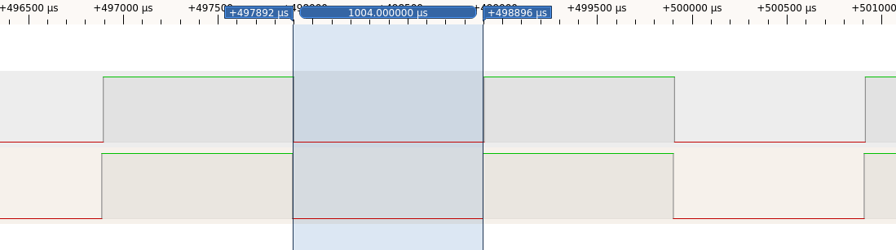

# Tasks

Lightweight and fast preemptive scheduler for STM8

This is a STM8S/STM8L port from Arduino library available from https://github.com/kcl93/Tasks 

This library implements a simple, preemptive task scheduler that is executed via a 1ms timer interrupt. 
It allows to define cyclic tasks or tasks that should be executed in the future in parallel to the normal program execution inside the main loop.

The task scheduler is executed every 1ms. A possibly running task is interrupted by this and only resumed after all succeeding tasks have finished. 
This means that always the task started last has the highest priority. This effect needs to be kept in mind when programming a software using this library.

A reference of the task scheduler library is available at https://htmlpreview.github.io/?https://github.com/kcl93/Tasks/blob/master/extras/html/index.html

In addition this library also implements the known Arduino time keeping functions `millis()`, `micros()`, `delay()` and `delayMicroseconds()`, 
plus a variable `g\_flagMilli` which is set in the timer interrupt and can be used to easily check if a millisecond has passed 

## Notes:

- Deadlocks can appear when one task waits for another taks which was started before.
- Timing critical tasks may not execute properly when they are interrupted for too long by other tasks. Thus it is recommended to keep task execution as short as possible.
- The STM8 leaves the interrupts state shortly after starting the task scheduler which makes the scheduler reentrant and allows any other interrupt (timer, UART, etc.) to be triggered.
- Slow, blocking tasks are interrupted if their duration is longer than the period of a faster task (see 1st screenshot of main.c)
- Time keeping functions `millis()` can be used within tasks (see main.c)
- If multiple tasks are due in the same timeslot, both are executed (see 2nd screenshot). Delay for task switch is ~6.25µs @ 16MHz 

  

  

## Supported Boards:

- all STM8AF & STM8S boards, e.g. STM8S Discovery, SDuino Uno, STM8S207 Nucleo etc. (only tested with these)
- all STM8AL & STM8L boards, e.g. STM8L Discovery etc. (only tested with these)

## Consumed interrupt:

- TIM4\_UPD\_ISR

***

## CPU runtime:

- 5μs without pending tasks
- 13μs + task duration when tasks are executed

Have fun! 
